This guide demonstrates how to set up i2pd as a netvm, allowing you to easily proxy traffic through the i2p network to access the clearnet or i2p services. This significantly enhances security and privacy.

This method is an improved implementation compared to the [I2pd netvm guide](https://forum.qubes-os.org/t/i2pd-netvm-guide/31402), utilizing debian-12 and avoiding the outdated i2pd-qt and archlinux community template.

## **Installation**

1. First, you need a **debian-12-xfce** template VM.

2. Clone this template and name it **debian-12-xfce-i2pd**.

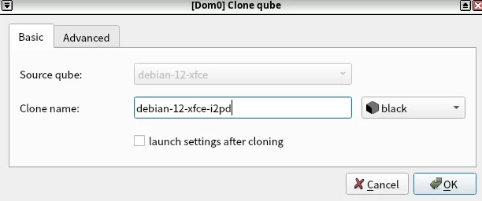

**Execute the following commands within the `debian-12-xfce-i2pd`:**

```bash
sudo apt install wget
wget -q -O - https://repo.i2pd.xyz/.help/add_repo | sudo bash -s -
sudo apt update
sudo apt install i2pd
```

This utilizes the i2pd team’s repository, which automatically provides the latest i2pd version.

3. Proceed to install clash-verge-rev:

Visit [Releases · clash-verge-rev/clash-verge-rev · GitHub](https://github.com/clash-verge-rev/clash-verge-rev/releases) to find the appropriate version of clash-verge-rev.  This guide uses the latest stable version, v2.0.2.  Ensure your debian-12-xfce-i2pd VM has a suitable netvm configured for internet access (you can download the .deb in another VM and transfer it to debian-12-xfce-i2pd).

```bash
wget https://github.com/clash-verge-rev/clash-verge-rev/releases/download/v2.0.2/Clash.Verge_2.0.2_amd64.deb
sudo apt install ./Clash.Verge_2.0.2_amd64.deb
shutdown now
```

## **Creating New appvm**

### Creating `sys-i2pd-out`

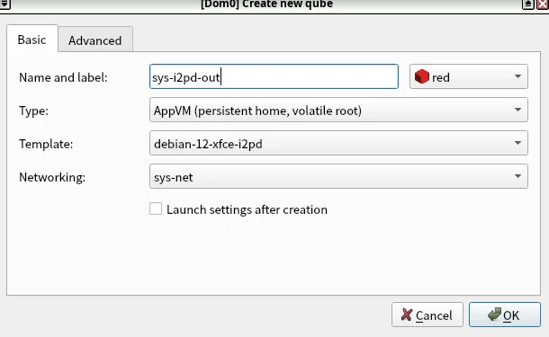

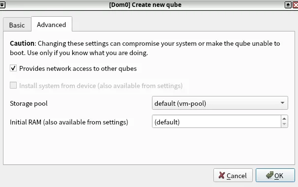

**Execute the following commands within `sys-i2pd-out`:**

```bash
sudo systemctl enable i2pd.service
sudo nft add rule ip qubes custom-input meta l4proto tcp ct state new,established tcp dport 4500 accept
```

Wait 10-20 minutes for i2pd to start accepting connections.

In another terminal tab, run the following command for simple monitoring:

```bash
watch curl --socks5-hostname 127.0.0.1:4447 acetone.i2p
```

Proceed to the next step once the above command receives a response.

### Modifying Startup Commands

1. Paste the following into `/rw/config/rc.local`:

```bash
#!/bin/bash
sudo nft add rule ip qubes custom-input meta l4proto tcp ct state new,established tcp dport 4500 accept
```

2. Add the following to `/rw/config/qubes-bind-dirs.d/50_user.conf`:

binds+=( '/etc/i2pd' )

3. Restart the **sys-i2pd-out** VM.

4. Paste the following into `/etc/i2pd/tunnels.conf`:

```
[socks-outproxy-tcp]
type = client
address = 0.0.0.0
port = 4500
keys = transient-outproxy
destination = outproxy.acetone.i2p
destinationport = 1080
inbound.length = 1
outbound.length = 1
inbound.lengthVariance = 1
outbound.lengthVariance = 1

[socks-outproxy-udp]
type = udpclient
address = 127.0.0.1
port = 4500
keys = transient-outproxy
destination = outproxy.acetone.i2p
destinationport = 1080
```

> You can modify some of these parameters if you need to use a different outproxy.

5. Add the following to the `[socksproxy]` section of `/etc/i2pd/i2pd.conf`:

```
outproxy.enabled = true
outproxy = 127.0.0.1
outproxyport = 4500
```

6. Restart the **sys-i2pd-out** VM.

### Creating `sys-i2pd-in`

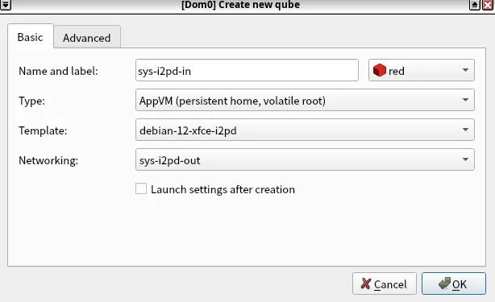

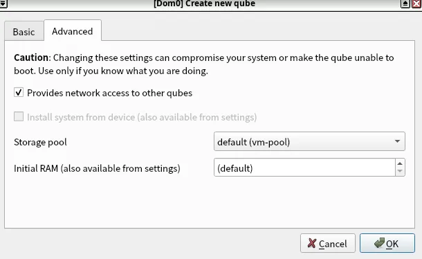

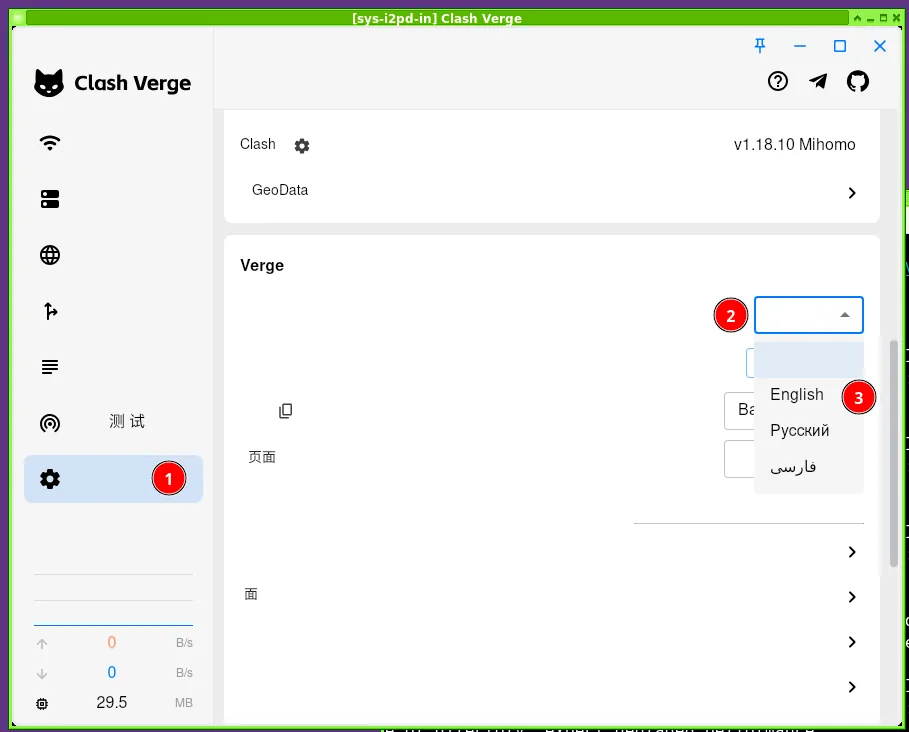

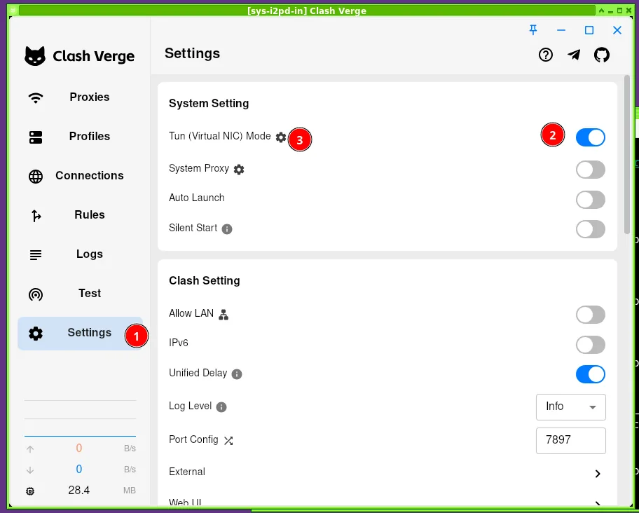

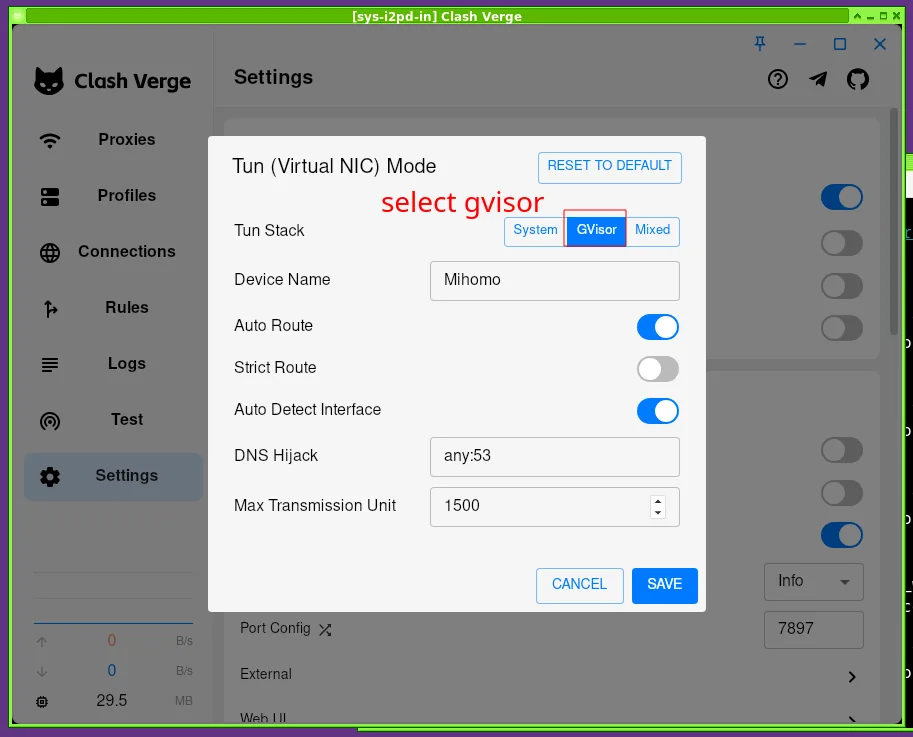
Open a terminal and type `clash-verge` to launch the application.

1. Create a new profile in the **Clash Verge** application:

  - Click `Profiles > New`

  - Select `Local` as the type and save.

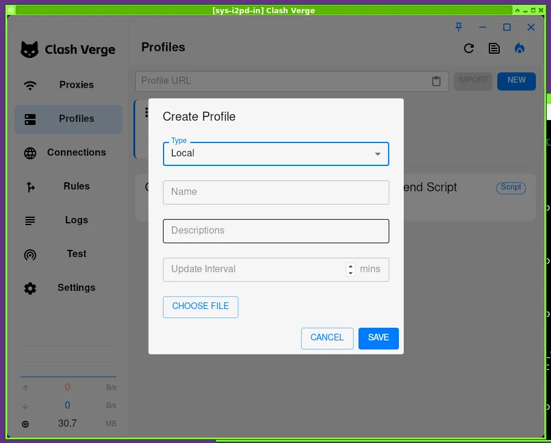

2. Edit proxy settings:

  - Click `MRB > Edit Proxies`.

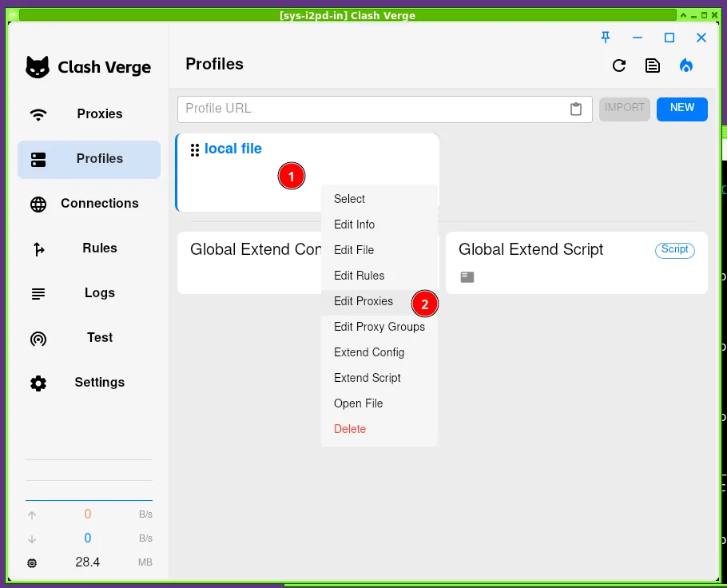

  - Check the IP address of **sys-i2pd-out** in Qube Manager.

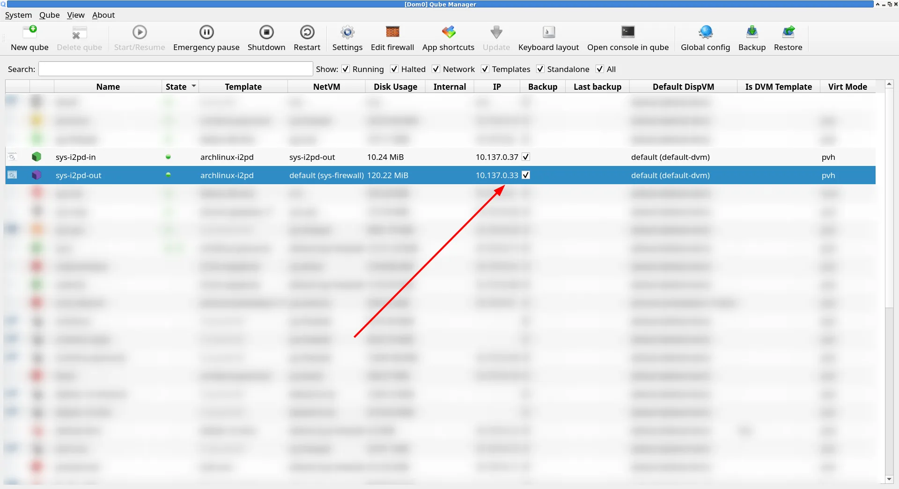

  - Enter `socks5://<YOUR_IP>:4500` and save.

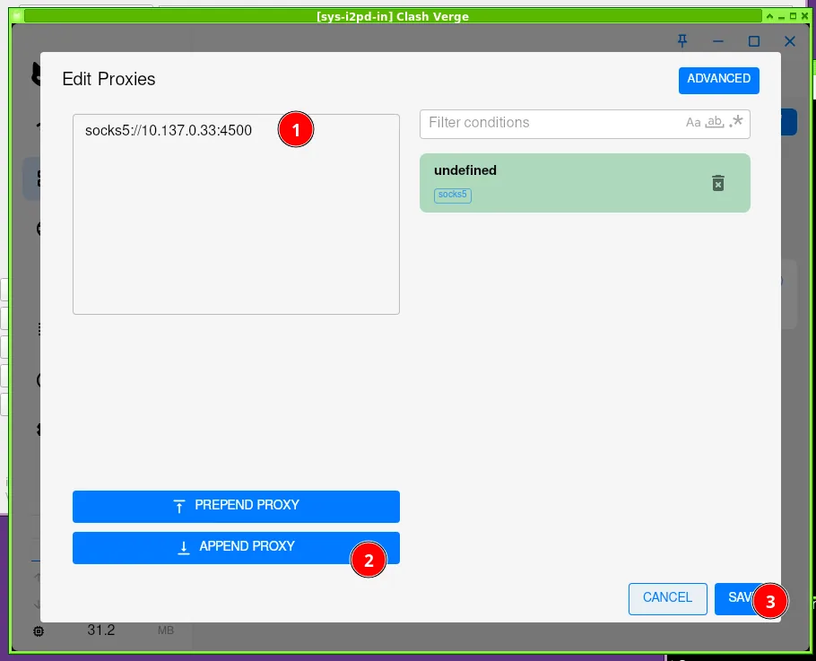

  - Enable the proxy in `Proxies > Global`.

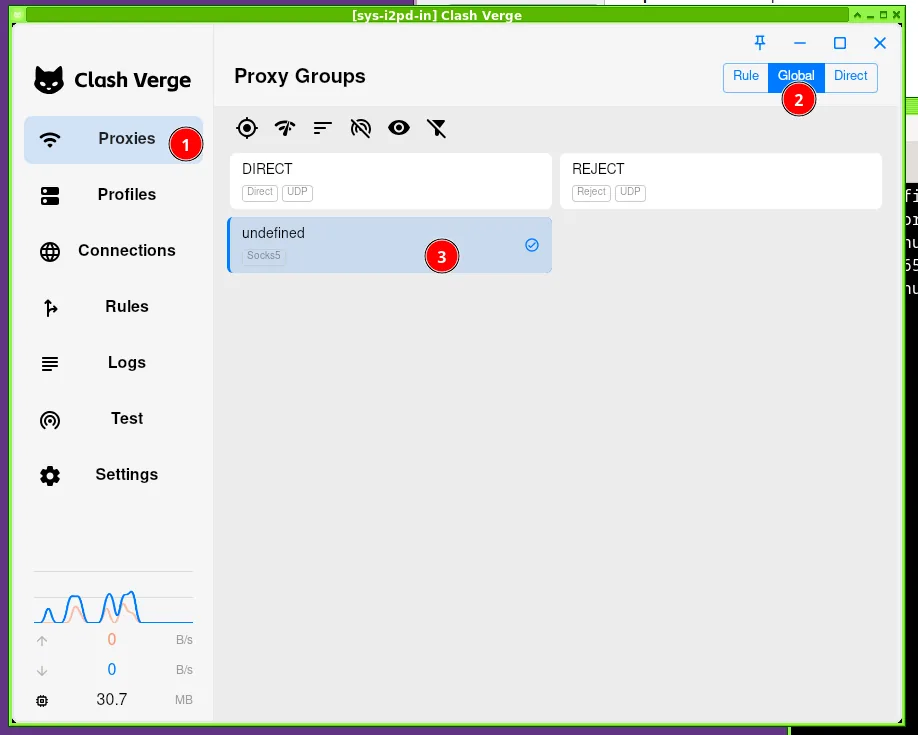

  - Enable autostart in `Setting > System Setting > Auto Launch`.

### Adding Firewall Rules (Kill Switch)

**Execute the following commands in dom0:**

```bash
qvm-firewall sys-i2pd-in reset
qvm-firewall sys-i2pd-in add accept <sys-i2pd-out-ip-here> dstports=4500 proto=tcp
qvm-firewall sys-i2pd-in del --rule-no 0
```

## Additional Information

### **Verification**

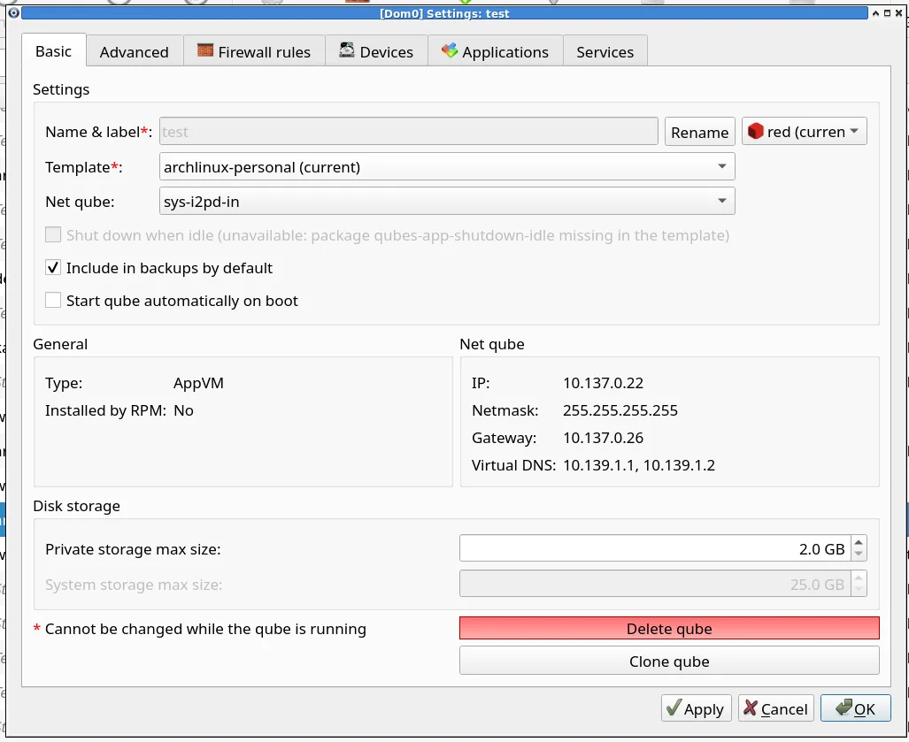

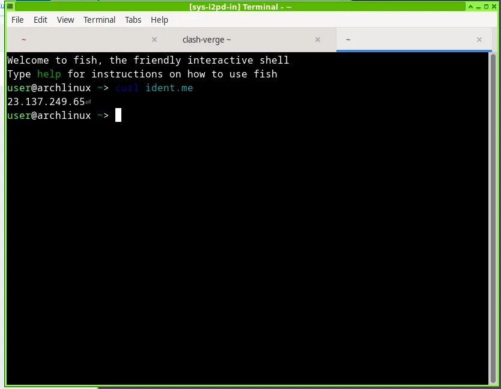
Create a new test VM and select sys-i2pd-in as its netvm to verify network functionality. You should be able to access both .i2p services and the clearnet.

### Donation

I’m still considering this.

### References

- [https://repo.i2pd.xyz/.help/readme.html](https://repo.i2pd.xyz/.help/readme.html)

- [i2pd documentation](https://i2pd.readthedocs.io/en/latest/)

- [How to make any file persistent (bind-dirs) | Qubes OS](https://www.qubes-os.org/doc/bind-dirs/)

- [GitHub - clash-verge-rev/clash-verge-rev: A modern GUI client based on Tauri, designed to run in Windows, macOS and Linux for tailored proxy experience](https://github.com/clash-verge-rev/clash-verge-rev)

- [I2pd netvm guide](https://forum.qubes-os.org/t/i2pd-netvm-guide/31402)
